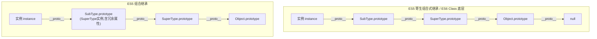

JavaScript 的继承机制经历了从 ES5 时代“手动模拟原型链”到 ES6 时代“Class 语法糖标准化”的演进。虽然 ES6 的 `class` 本质上是基于原型的语法糖，但其底层实现逻辑（特别是 `this` 的生成顺序）与 ES5 有着根本性的区别。


以下是按照时间演进顺序，对 ES5 和 ES6 继承方式的详细解析。

  

---


### 一、 核心概念：原型与原型链

在深入具体继承方式前，必须明确两个核心概念，这是所有继承方式的基石：

1.  `prototype`：函数（构造函数）的一个属性，指向一个对象（原型对象）。这个对象包含了由该构造函数创建的所有实例共享的属性和方法。

2.  `__proto__` (或 `[[Prototype]]`)：每个实例对象内部都有一个隐藏链接，指向创建它的构造函数的 `prototype`。

3.  原型链查找机制：当访问一个对象的属性时，JS 引擎先在对象自身查找；若找不到，则沿着 `__proto__` 向上查找原型对象；若还找不到，继续向上查找原型的原型，直到 `null`。

  关系如图：
```text

实例对象 --(__proto__)--> 构造函数.prototype --(__proto__)--> Object.prototype --(__proto__)--> null

```

  

---


### 二、 ES5 继承方案（2009 - 2015）

ES5 没有 `class` 关键字，开发者通过操作函数和原型对象来模拟类继承。其核心思路是：先创建子类的 `this`，再把父类的属性方法“嫁接”到这个 `this` 上。

#### 1. 原型链继承 (Prototype Chain Inheritance)

**原理**：将==子类的原型==对象指向==父类的实例==。

**逻辑**：`SubType.prototype = new SuperType()`

  
代码示例：
```javascript
function SuperType() {
    this.colors = ["red", "blue"];
}

SuperType.prototype.sayName = function() {
    console.log("Super");
};

function SubType() {}

// 关键步骤：子类原型指向父类实例
SubType.prototype = new SuperType();
SubType.prototype.constructor = SubType; // 修正 constructor 指向

const instance = new SubType();
instance.colors.push("green"); 

console.log(instance.colors); // ["red", "blue", "green"]
```


原型链关系图：
```text
instance 
  | (__proto__)
  v
SubType.prototype (即 SuperType 的实例) 
  | (__proto__)
  v
SuperType.prototype 
  | (__proto__)
  v
Object.prototype --> null
```

*   优点：父类新增的原型方法/属性，子类都能访问；实现简单。

*   缺点：
    1.  引用类型共享问题：==所有子类实例共享父类实例中的引用类型属性（如数组 `colors`），修改一个会影响其他所有实例==。
    2.  无法传参：创建子类实例时，无法向父类构造函数传递参数。

*   使用频率：低。仅用于教学或极简单场景，生产环境几乎不单独使用。


#### 2. 构造函数继承 (Constructor Stealing / Call Inheritance)

**原理**：在子类构造函数中调用父类构造函数，借用 `call` 或 `apply` 改变 `this` 指向。

**逻辑**：`SuperType.call(this, args)`


代码示例：
```javascript
function SuperType(name) {
    this.name = name;
    this.colors = ["red", "blue"];
}

SuperType.prototype.sayName = function() {
    console.log(this.name);
};


function SubType(name, age) {

    // 关键步骤：借用父类构造函数
    SuperType.call(this, name); 
    this.age = age;
}

const instance1 = new SubType("Alice", 20);
const instance2 = new SubType("Bob", 25);
  
instance1.colors.push("green");

console.log(instance1.colors); // ["red", "blue", "green"]
console.log(instance2.colors); // ["red", "blue"] (互不影响)
console.log(instance1.sayName); // undefined (无法继承原型方法)
```

  
原型链关系图：

```text
instance 
  | (__proto__)
  v
SubType.prototype 
  | (__proto__)
  v
Object.prototype --> null

(注意：与 SuperType.prototype 断开连接)
```

*   优点：解决了引用类型共享问题；可以向父类传参。

*   缺点：
    1.  无法继承原型方法：只能继承实例属性，父类原型上的方法（如 `sayName`）无法访问。
    2.  函数复用性差: 方法都在构造函数中定义，每次创建实例都会创建新的函数副本。

*   使用频率：低。通常作为组合继承的一部分。
  

#### 3. 组合继承 (Combination Inheritance) —— ES5 主流方案

**原理**：结合上述两者。使用原型链继承原型上的方法，使用构造函数继承实例属性。

**逻辑**：`SubType.prototype = new SuperType()` + `SuperType.call(this)`

  
代码示例：
```javascript
function SuperType(name) {
    this.name = name;
    this.colors = ["red", "blue"];
}

SuperType.prototype.sayName = function() {
    console.log(this.name);
};

  
function SubType(name, age) {
    // 第二次调用 SuperType
    SuperType.call(this, name); 
    this.age = age;
}

  
// 第一次调用 SuperType
SubType.prototype = new SuperType();
SubType.prototype.constructor = SubType;
SubType.prototype.sayAge = function() {
    console.log(this.age);
};

const instance = new SubType("Alice", 20);
instance.sayName(); // Alice
instance.sayAge();  // 20
```

  
原型链关系图：
```text
instance 
  | (__proto__)
  v
SubType.prototype (是一个 SuperType 实例，包含多余的 name/colors 属性)
  | (__proto__)
  v
SuperType.prototype 
  | (__proto__)
  v
Object.prototype --> null
```


*   优点：融合了前两者的优点，既实现了方法复用，又保证了实例属性的独立。

*   缺点：效率问题。父类构造函数被调用了==两次（一次在 `new SuperType()`，一次在 `SuperType.call()`）==。导致子类原型上存在一份多余的父类实例属性。

*   使用频率：==高==。是 ES5 时代最常用、最标准的继承模式。

  
#### 4 寄生组合式继承 (Parasitic Combination Inheritance) ——简易版

代码示例来源地址：[[https://developer.mozilla.org/zh-CN/docs/Web/JavaScript/Reference/Operators/new.target#%E4%BD%BF%E7%94%A8_reflect.construct_%E7%9A%84_new.target]]

```javascript
function Base() {
  this.name = "基类";
}

function Extended() {
  // 让 Base() 构造函数可在现有的 `this` 值上工作，
  // 而不是在 `new` 创建的新对象上工作的唯一方法。
  Base.call(this);
  this.otherProperty = "子类";
}

Object.setPrototypeOf(Extended.prototype, Base.prototype);
Object.setPrototypeOf(Extended, Base);

console.log(new Extended()); // Extended { name: '基类', otherProperty: '子类' }
```
这段代码展示的是 ‌**ES5 寄生组合式继承（Parasitic Combination Inheritance）**‌ 的一种现代简化实现，或者更准确地说，是 ‌**==结合了构造函数借用和原型链设置的混合继承**‌==。

虽然它没有使用经典的 `inheritPrototype` 辅助函数写法，但其核心逻辑完全符合寄生组合式继承的特征：通过 `call` 继承实例属性，通过设置原型链继承原型方法，且避免了父类构造函数的重复调用。

  
##### 1. 代码解析

这段代码由两个关键部分组成：

第一部分：构造函数借用（继承实例属性）

```javascript
function Extended() {
  Base.call(this); // 在 Extended 的实例上下文中执行 Base 构造函数
  this.otherProperty = "子类";
}
```

*   作用：让 `Base` 构造函数在 `Extended` 新创建的实例（`this`）上运行。
*   结果：`Extended` 的实例拥有了 `Base` 中定义的实例属性（如 `name`）。
*   优势：解决了原型链继承中“引用类型属性共享”的问题，每个实例都有独立的 `name` 副本。
  
第二部分：原型链设置（继承原型方法）
```javascript
Object.setPrototypeOf(Extended.prototype, Base.prototype);

Object.setPrototypeOf(Extended, Base);
```

*   `Object.setPrototypeOf(Extended.prototype, Base.prototype)`：
    *   这是核心步骤。它将 `Extended.prototype` 的原型指向 `Base.prototype`。
    *   等价于 ES5 经典写法：`Extended.prototype = Object.create(Base.prototype)`。
    *   优势：相比传统的 `Extended.prototype = new Base()`，这种方式不会调用 `Base` 构造函数，因此不会在 `Extended.prototype` 上创建多余的实例属性（如 `name`），避免了内存浪费和原型污染。

*   `Object.setPrototypeOf(Extended, Base)`：
    *   这一步建立了类本身之间的继承关系（静态继承）。
    *   这意味着如果 `Base` 上有静态方法（如 `Base.staticMethod = function(){}`），`Extended` 也能访问到。这在传统 ES5 手写继承中常被忽略，但在 ES6 `class extends` 中是默认行为。


##### 2. 这种继承方式在前面的汇总中对应哪一类？

在我之前提供的汇总中，这属于 ES5 寄生组合式继承（Parasitic Combination Inheritance） 的变体或现代等效实现。

*   ==经典寄生组合式继承写法==：

    ```javascript
    function inheritPrototype(subType, superType) {
        var prototype = Object.create(superType.prototype); // 创建对象
        prototype.constructor = subType;                    // 增强对象
        subType.prototype = prototype;                      // 指定对象
    }
    inheritPrototype(Extended, Base);
    ```

*   你提供的代码写法：

    ```javascript
    Object.setPrototypeOf(Extended.prototype, Base.prototype);

    // 注意：通常还需要手动修正 constructor
    Extended.prototype.constructor = Extended; 
    ```

    `Object.setPrototypeOf` 是 ES6 引入的方法，但它操作的是 ES5 的原型机制。它的效果与 `Object.create` 类似，都是为了避免 `new Base()` 带来的副作用。


##### 3. 为什么说是“寄生组合式”？

*   “组合”：因为它结合了“构造函数继承”（`Base.call(this)`）和“原型链继承”（设置 `prototype` 链接）。

*   “寄生”：因为它通过 `Object.setPrototypeOf`（或 `Object.create`）“寄生”在一个空对象或纯净的原型副本上，而不是直接通过 `new Base()` 生成一个包含多余属性的实例作为原型。

*   “最优”：它是 ES5 时代解决继承问题的终极方案，只调用一次父类构造函数，原型链干净，支持实例属性独立和原型方法共享。

##### 4. 补充说明：`Object.setPrototypeOf` 的注意事项

虽然这段代码工作正常，但在高性能场景中，`Object.setPrototypeOf` 可能会比 `Object.create` 慢，因为它会修改现有对象的原型，可能导致 JavaScript 引擎优化失效（Deoptimization）。

##### 5.更推荐的现代 ES5+ 写法（等同于 Babel 转译后的部分逻辑）：


```javascript
function Base() {
  this.name = "基类";
}
Base.prototype.getName = function() {
  return this.name;
};
function Extended() {
  Base.call(this); // 继承实例属性
  this.otherProperty = "子类";
}

// 继承原型方法 (推荐用 Object.create，性能更好)
Extended.prototype = Object.create(Base.prototype);

// 修正 constructor 指向
Extended.prototype.constructor = Extended;

// 继承静态方法 (可选，如果需要)
Object.setPrototypeOf(Extended, Base);

console.log(new Extended()); 

// Extended { name: '基类', otherProperty: '子类' }
console.log(new Extended().getName()); // '基类'

```


##### 6.总结

- ‌**继承类型**‌：ES5 寄生组合式继承（使用现代 API `Object.setPrototypeOf` 实现）。
- ‌**是否汇总过**‌：是的，在前文“ES5 继承方案”的第 4 点“寄生组合式继承”中已详细讲解。你提供的代码是该模式的一种更简洁、现代的写法，同时额外处理了静态属性的继承。
- ‌**核心优势**‌：避免了组合继承中父类构造函数被调用两次的问题，原型链纯净，是 ES5 环境下最理想的继承实现。


#### 5. 寄生组合式继承 (Parasitic Combination Inheritance) —— ==ES5 最优方案==

**原理**：通过借用构造函数继承属性，通过原型式继承（`Object.create`）来继承原型方法，避免调用两次父类构造函数。

**逻辑**：`SubType.prototype = Object.create(SuperType.prototype)`


代码示例：
```javascript
function inheritPrototype(subType, superType) {

    // 创建对象：创建父类原型的一个副本
    const prototype = Object.create(superType.prototype);
    
    // 增强对象：弥补因重写原型而失去的默认 constructor 属性
    prototype.constructor = subType;

    // 指定对象：将新创建的对象赋值给子类型的原型
    subType.prototype = prototype;
}

function SuperType(name) {
    this.name = name;
    this.colors = ["red", "blue"];
}

SuperType.prototype.sayName = function() {
    console.log(this.name);
};

function SubType(name, age) {
    SuperType.call(this, name);
    this.age = age;
}

// 关键步骤：使用 Object.create 建立原型链，而非 new SuperType()
inheritPrototype(SubType, SuperType);
  

SubType.prototype.sayAge = function() {
    console.log(this.age);
};

const instance = new SubType("Alice", 20);

instance.sayName(); // Alice
```

原型链关系图：
```text
instance 
  | (__proto__)
  v
SubType.prototype (空对象，__proto__ 指向 SuperType.prototype)
  | (__proto__)
  v
SuperType.prototype 
  | (__proto__)
  v
Object.prototype --> null

```

*   优点：只调用了一次父类构造函数，避免了在 `SubType.prototype` 上创建不必要的属性；原型链保持纯净。这也是 Babel 转译 ES6 class 的核心逻辑。

*   缺点：代码实现稍显复杂。

*   使用频率：中。常见于大型框架（如早期 Vue、React 辅助库）的底层实现，是 ES5 继承的终极形态。

  

---

  
### 三、 ES6 继承方案（2015 至今）

ES6 引入了 `class`、`extends` 和 `super` 关键字，使继承变得清晰且规范。**其底层实现本质上就是寄生组合式继承**，但有一个关键差异：==ES6 是“先创建父类 this，再修饰它”==。

class详细文档地址：[[https://es6.ruanyifeng.com/#docs/class-extends]]

#### 1. 核心（主要原理）

**该节文档来源于**：[[https://es6.ruanyifeng.com/#docs/class-extends#%E7%B1%BB%E7%9A%84-prototype-%E5%B1%9E%E6%80%A7%E5%92%8C__proto__%E5%B1%9E%E6%80%A7]]

Class 作为构造函数的语法糖，同时有`prototype`属性和`__proto__`属性，因此同时存在==两条继承链==。

（1）子类的`__proto__`属性，表示构造函数的继承，总是指向父类。

（2）子类`prototype`属性的`__proto__`属性，表示方法的继承，总是指向父类的`prototype`属性。

```javascript
class A {
}

class B extends A {
}

B.__proto__ === A // true
B.prototype.__proto__ === A.prototype // true
```

上面代码中，子类`B`的`__proto__`属性指向父类`A`，子类`B`的`prototype`属性的`__proto__`属性指向父类`A`的`prototype`属性。

这样的结果是==因为==，类的继承是按照下面的模式实现的。

```javascript
class A {
}

class B {
}

// B 的实例继承 A 的实例
Object.setPrototypeOf(B.prototype, A.prototype);

// B 继承 A 的静态属性
Object.setPrototypeOf(B, A);

const b = new B();
```

《对象的扩展》一章给出过`Object.setPrototypeOf`方法的实现。

```javascript
Object.setPrototypeOf = function (obj, proto) {
  obj.__proto__ = proto;
  return obj;
}
```

因此，就得到了上面的结果。

```javascript
Object.setPrototypeOf(B.prototype, A.prototype);
// 等同于
B.prototype.__proto__ = A.prototype;

Object.setPrototypeOf(B, A);
// 等同于
B.__proto__ = A;
```

这两条继承链，可以这样理解：
- 作为一个**对象**，子类（`B`）的原型（`__proto__`属性）是父类（`A`）；
- 作为一个**构造函数**，子类（`B`）的原型对象（`prototype`属性）是父类的原型对象（`prototype`属性）的实例。

```javascript
B.prototype = Object.create(A.prototype);
// 等同于
B.prototype.__proto__ = A.prototype;
```

`extends`关键字后面可以跟多种类型的值。

```javascript
class B extends A {
}
```

==上面代码的`A`，只要是一个有`prototype`属性的函数，就能被`B`继承==。由于函数都有`prototype`属性（除了`Function.prototype`函数，该函数没有prototype），因此`A`可以是任意普通函数（不能是箭头函数，因为箭头函数没有this,也没有prototype）。


#### 2. Class 继承

原理：
1.  `extends` 关键字建立原型链关系（见1）。
2.  `super()` 调用父类构造函数，==生成父类的 `this` 上下文==。
3.  ES6 规定：子类必须在 `constructor` 中调用 `super()` 之后才能使用 `this`。这与 ES5 “先创建子类 this，再挂载父类属性”截然不同。

代码示例：
```javascript
//父
class SuperType {
    constructor(name) {
        this.name = name;
        this.colors = ["red", "blue"];
    }

    sayName() {
        console.log(this.name);
    }
}

//子
class SubType extends SuperType {
    constructor(name, age) {
        // 必须先调用 super，否则报错
        super(name); 
        this.age = age;
    }

    sayAge() {
        console.log(this.age);
    }
}

const instance = new SubType("Alice", 20);
instance.sayName(); // Alice
instance.sayAge();  // 20

console.log(instance instanceof SuperType); // true
```


原型链关系图：

ES6 class 继承不仅建立了实例的原型链，还建立了类本身的原型链（用于继承静态方法）。
```text

1. 实例层级：

instance 
  | (__proto__)
  v
SubType.prototype 
  | (__proto__)
  v
SuperType.prototype 
  | (__proto__)
  v
Object.prototype --> null

  

2. 类层级（静态继承）：

SubType 
  | (__proto__)
  v
SuperType 
  | (__proto__)
  v
Function.prototype --> ...
```

*   优点：
    1.  语法清晰：代码可读性极高，接近传统面向对象语言。
    2.  原生支持：完美继承原生构造函数（如 `Array`, `Date`, `Error`），这在 ES5 中极难实现。
    3.  静态继承：自动继承父类的静态方法和属性。

*   缺点：兼容性需考虑（现代浏览器和 Node.js 已完全支持，老旧环境需 Babel 转译）。

*   使用频率：极高。现代 JavaScript 开发的标准写法。

  
---

  

### 四、 总结对比与场景建议

| 特性 | ES5 组合继承 | ES5 寄生组合继承 | ES6 Class 继承 |
| --- | --- | --- | --- |
| ‌核心逻辑‌ | 原型链 + 构造函数借用 | Object.create + 构造函数借用 | extends + super |
| ‌父类构造函数调用次数‌ | 2 次 | 1 次 | 1 次 |
| ‌原型链纯净度‌ | 有冗余属性 | 纯净 | 纯净 |
| ‌原生对象继承‌ | 困难/不支持 | 困难/不支持 | 完美支持 |
| ‌代码复杂度‌ | 中等 | 高 | 低 |
| ‌使用频率‌ | 旧项目常见 | 库源码常见 | ‌新项目标准‌ |

  

#### 场景建议

1.  现代项目开发：
    *   ==首选 ES6 `class extends`。它是标准、简洁且功能最强的方案。无论是业务代码还是工具库，都应优先使用。==

2.  维护老旧项目（ES5 环境）：
    *   如果看到组合继承，理解其原理即可，无需重构，除非有性能瓶颈。
    *   如果在编写底层工具函数且追求极致性能/纯净原型，可参考寄生组合式继承的逻辑（或直接使用 `Object.create`）。
  
3.  面试与底层原理研究：
    *   必须掌握原型链查找机制。
    *   必须能手写寄生组合式继承，因为它揭示了 JS 继承的本质，也是 Babel 转译 ES6 class 的核心逻辑。
    *   理解 ES5 和 ES6 在 `this` 生成顺序上的根本差异（ES5: 先子后父；ES6: 先父后子）。

  
#### 原型链关系一图流总结




  

#### 结论
ES6 的 `class` 继承并非全新的机制，而是对 ES5 最优实践（寄生组合式继承）的语法封装。理解 ES5 的手动实现，有助于你深刻理解 ES6 `super` 和 `extends` 背后到底发生了什么。


### 参考资料

<br>[1] [ES5的继承和ES6的继承有什么区别?让Babel来告诉你 - 腾讯云](https://cloud.tencent.com/developer/article/1960591)<br>[2] [深入解析JavaScript继承:ES5与ES6的对比与演进 - 雪旭 - 博客园 - 博客园](https://www.cnblogs.com/zimengxiyu/p/18730508)<br>[3] [JavaScript ES5 与 ES6 中的类(Class)详解 - 腾讯云](https://cloud.tencent.com/developer/article/2510990)<br>[4] [ES5与ES6五大核心区别详解(前端必学对比教程)_es6和es5写法的差异-CSDN博客 - CSDN博客](https://blog.csdn.net/2602_95057108/article/details/163095588)<br>[5] [ES5 继承和 ES6 继承有什么区别? - 有驾](https://m.yoojia.com/pages/dongtai/index?id=4461008002&from_src=biji_tab)<br>[6] [ES5和ES6的继承剖析 - 拼凑我的梦_minsion](http://www.bilibili.com/video/BV1GR4y1F7AB?p=2)<br>[7] [Es5 javascript实现继承的5种方式及对应缺点(超详细) - CSDN博客](https://blog.csdn.net/weixin_53541596/article/details/139547234)<br>[8] [Js如何模拟继承机制分别使用Es5和Es6来实现 - 腾讯云](https://cloud.tencent.com/developer/article/2226473)<br>[9] [【JS进阶】ES5 实现继承的几种方式 - CSDN博客](https://blog.csdn.net/iffkl86334/article/details/151154023)<br>[10] [前端面试暂停!26年5月准备前端面试,背这些就够了...3天刷完速通前端面试offer!! - 方格前端讲面试](http://www.bilibili.com/video/BV1TtLw6oEes?p=35)<br>[11] [前端开发,必知ES5、ES6的7种继承 - 腾讯云](https://cloud.tencent.com/developer/article/2239062)<br>[12] [es6类和继承的实现原理 - 腾讯云](https://cloud.tencent.com/developer/article/1500264)<br>[13] [前端-一篇文章理解 JS 继承 - 腾讯云](https://cloud.tencent.com/developer/article/1408335)<br>[14] [深入理解 JavaScript 原型、原型链与继承机制 - 腾讯云](https://cloud.tencent.com/developer/article/2628484)<br>[15] [快人一步【前端面试题】逼自己在春节刷完,来年春招拿offer轻轻松松的! - 程序员方格](http://www.bilibili.com/video/BV1n26gBAEuK?p=23)<br>[16] [目前B站最新2026【前端面试题】包含所有大厂高频题!7天就能从面试小白到大神!少走99%的弯路! - 前端面试速成](http://www.bilibili.com/video/BV15L6JBjErb?p=61)<br>[17] [2026金三银四拿下Web前端面试,1天掌握别人半个月刷的Web前端面试知识点,成功拿下45K! (JavaScript核心基础、框架原理 等高频面试题) - 我就是娇滴滴的女王](http://www.bilibili.com/video/BV1mWfyBDEXJ?p=22)<br>[18] [【涨薪10k+】2026最新前端面试题大合集,全套200集,3天刷完涨薪10K+!现在开始背,26年春招面试通过率98% - 前端大爆炸z](http://www.bilibili.com/video/BV1LR6gBoEyW?p=22)<br>[19] [JavaScript原型继承深度解析:从ES5到ES6 Class的演进与实践 - CSDN博客](https://blog.csdn.net/weixin_32325225/article/details/164103943)<br>[20] [ES5 与 ES6 使用 `new` 关键字实例化对象的流程剖析 - CSDN博客](https://blog.csdn.net/weixin_42554191/article/details/158920340)<br>[21] [JavaScript ES5 vs ES6 核心特性对比 - 腾讯云](https://cloud.tencent.com/developer/article/2595879)<br>[22] [ES5和ES6继承的区别「建议收藏」 - 腾讯云](https://cloud.tencent.com/developer/article/2164327)<br>[23] [es6继承和es5继承有什么区别 - www.jylskj.cn](http://www.jylskj.cn/article/gcehsp.html)<br>[24] [ES5和ES6的继承对比 - 言先生 - 博客园 - 博客园](https://www.cnblogs.com/yanchenyu/p/11459334.html)<br>[25] [前端每日一练:JavaScript继承方式有几种?ES6 的继承和 ES5 的继承的区别 - CSDN博客](https://blog.csdn.net/SAXX2/article/details/136623105)<br>[26] [浅谈ES5和ES6继承和区别 - 墨韵明空 - 博客园 - 博客园](https://www.cnblogs.com/wymbk/p/9290232.html)<br>[27] [js类的继承,es5和es6的方法 - 阳光毛毛泡泡 - 博客园 - 博客园](https://www.cnblogs.com/shaokevin/p/9789950.html)<br>[28] [ES5/ES6 的继承除了写法以外还有什么区别-阿里云开发者社区 - 阿里云开发者社区](https://developer.aliyun.com/article/1625872)<br><br>百度AI生成，内容仅供参考