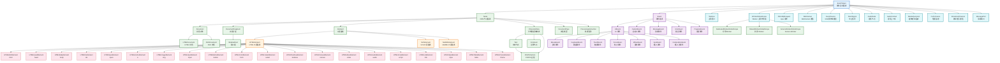

```mermaid
graph TD
    %% 顶层基类
    EventTarget["EventTarget<br/>事件目标基类"]

    %% Node 分支
    EventTarget --> Node["Node<br/>DOM 节点基类"]

    Node --> Document["Document<br/>文档对象"]
    Node --> DocumentFragment["DocumentFragment<br/>文档片段"]
    Node --> Element["Element<br/>元素基类"]
    Node --> CharacterData["CharacterData<br/>字符数据抽象类"]
    Node --> DocumentType["DocumentType<br/>文档类型"]
    Node --> ProcessingInstruction["ProcessingInstruction<br/>处理指令"]

    %% Document 分支
    Document --> HTMLDocument["HTMLDocument<br/>HTML 文档"]
    Document --> XMLDocument["XMLDocument<br/>XML 文档"]

    %% DocumentFragment 分支
    DocumentFragment --> ShadowRoot["ShadowRoot<br/>影子根"]

    %% Element 分支
    Element --> HTMLElement["HTMLElement<br/>HTML 元素基类"]
    Element --> SVGElement["SVGElement<br/>SVG 元素基类"]
    Element --> MathMLElement["MathMLElement<br/>MathML 元素基类"]

    %% HTMLElement 常用子类
    HTMLElement --> HTMLHtmlElement["HTMLHtmlElement<br/>html"]
    HTMLElement --> HTMLHeadElement["HTMLHeadElement<br/>head"]
    HTMLElement --> HTMLBodyElement["HTMLBodyElement<br/>body"]
    HTMLElement --> HTMLDivElement["HTMLDivElement<br/>div"]
    HTMLElement --> HTMLSpanElement["HTMLSpanElement<br/>span"]
    HTMLElement --> HTMLAnchorElement["HTMLAnchorElement<br/>a"]
    HTMLElement --> HTMLImageElement["HTMLImageElement<br/>img"]
    HTMLElement --> HTMLInputElement["HTMLInputElement<br/>input"]
    HTMLElement --> HTMLButtonElement["HTMLButtonElement<br/>button"]
    HTMLElement --> HTMLFormElement["HTMLFormElement<br/>form"]
    HTMLElement --> HTMLSelectElement["HTMLSelectElement<br/>select"]
    HTMLElement --> HTMLTextAreaElement["HTMLTextAreaElement<br/>textarea"]
    HTMLElement --> HTMLCanvasElement["HTMLCanvasElement<br/>canvas"]
    HTMLElement --> HTMLVideoElement["HTMLVideoElement<br/>video"]
    HTMLElement --> HTMLAudioElement["HTMLAudioElement<br/>audio"]
    HTMLElement --> HTMLScriptElement["HTMLScriptElement<br/>script"]
    HTMLElement --> HTMLLinkElement["HTMLLinkElement<br/>link"]
    HTMLElement --> HTMLStyleElement["HTMLStyleElement<br/>style"]
    HTMLElement --> HTMLTableElement["HTMLTableElement<br/>table"]
    HTMLElement --> HTMLIFrameElement["HTMLIFrameElement<br/>iframe"]

    %% CharacterData 分支
    CharacterData --> Text["Text<br/>文本节点"]
    CharacterData --> Comment["Comment<br/>注释节点"]
    CharacterData --> CDATASection["CDATASection<br/>CDATA 区段"]

    Text --> CDATASection

    %% 事件相关接口
    EventTarget --> Event["Event<br/>事件基类"]
    Event --> UIEvent["UIEvent<br/>UI 事件"]
    Event --> CustomEvent["CustomEvent<br/>自定义事件"]
    Event --> MessageEvent["MessageEvent<br/>消息事件"]
    Event --> ErrorEvent["ErrorEvent<br/>错误事件"]
    Event --> ProgressEvent["ProgressEvent<br/>进度事件"]

    UIEvent --> MouseEvent["MouseEvent<br/>鼠标事件"]
    UIEvent --> KeyboardEvent["KeyboardEvent<br/>键盘事件"]
    UIEvent --> TouchEvent["TouchEvent<br/>触摸事件"]
    UIEvent --> FocusEvent["FocusEvent<br/>焦点事件"]
    UIEvent --> WheelEvent["WheelEvent<br/>滚轮事件"]
    UIEvent --> InputEvent["InputEvent<br/>输入事件"]
    UIEvent --> CompositionEvent["CompositionEvent<br/>输入法事件"]

    %% 其他常用 EventTarget 子类
    EventTarget --> Window["Window<br/>全局窗口"]
    EventTarget --> WorkerGlobalScope["WorkerGlobalScope<br/>Worker 全局作用域"]
    EventTarget --> XMLHttpRequest["XMLHttpRequest<br/>Ajax 请求"]
    EventTarget --> WebSocket["WebSocket<br/>WebSocket 通信"]
    EventTarget --> EventSource["EventSource<br/>SSE 服务端推送"]
    EventTarget --> AbortSignal["AbortSignal<br/>中止信号"]
    EventTarget --> AudioNode["AudioNode<br/>音频节点"]
    EventTarget --> AudioContext["AudioContext<br/>音频上下文"]
    EventTarget --> MediaQueryList["MediaQueryList<br/>媒体查询监听"]
    EventTarget --> Performance["Performance<br/>性能监控"]
    EventTarget --> BroadcastChannel["BroadcastChannel<br/>跨标签页通信"]
    EventTarget --> MessagePort["MessagePort<br/>消息端口"]

    %% WorkerGlobalScope 分支
    WorkerGlobalScope --> DedicatedWorkerGlobalScope["DedicatedWorkerGlobalScope<br/>专用 Worker"]
    WorkerGlobalScope --> SharedWorkerGlobalScope["SharedWorkerGlobalScope<br/>共享 Worker"]
    WorkerGlobalScope --> ServiceWorkerGlobalScope["ServiceWorkerGlobalScope<br/>Service Worker"]

    %% 样式标注
    classDef base fill:#e3f2fd,stroke:#1565c0,stroke-width:2px;
    classDef node fill:#e8f5e9,stroke:#2e7d32,stroke-width:2px;
    classDef element fill:#fff3e0,stroke:#ef6c00,stroke-width:2px;
    classDef html fill:#fce4ec,stroke:#c62828,stroke-width:1px;
    classDef event fill:#f3e5f5,stroke:#6a1b9a,stroke-width:2px;
    classDef other fill:#e0f7fa,stroke:#00838f,stroke-width:2px;

    class EventTarget base;
    class Node,Document,DocumentFragment,Element,CharacterData,DocumentType,ProcessingInstruction node;
    class HTMLElement,SVGElement,MathMLElement element;
    class HTMLHtmlElement,HTMLHeadElement,HTMLBodyElement,HTMLDivElement,HTMLSpanElement,HTMLAnchorElement,HTMLImageElement,HTMLInputElement,HTMLButtonElement,HTMLFormElement,HTMLSelectElement,HTMLTextAreaElement,HTMLCanvasElement,HTMLVideoElement,HTMLAudioElement,HTMLScriptElement,HTMLLinkElement,HTMLStyleElement,HTMLTableElement,HTMLIFrameElement html;
    class Event,UIEvent,CustomEvent,MessageEvent,ErrorEvent,ProgressEvent,MouseEvent,KeyboardEvent,TouchEvent,FocusEvent,WheelEvent,InputEvent,CompositionEvent event;
    class Window,WorkerGlobalScope,XMLHttpRequest,WebSocket,EventSource,AbortSignal,AudioNode,AudioContext,MediaQueryList,Performance,BroadcastChannel,MessagePort other;
```

##### 第三方网站在线查看

(在线关系图)[https://t99.github.io/webidlpedia/?idlname=SVGTextPositioningElement]