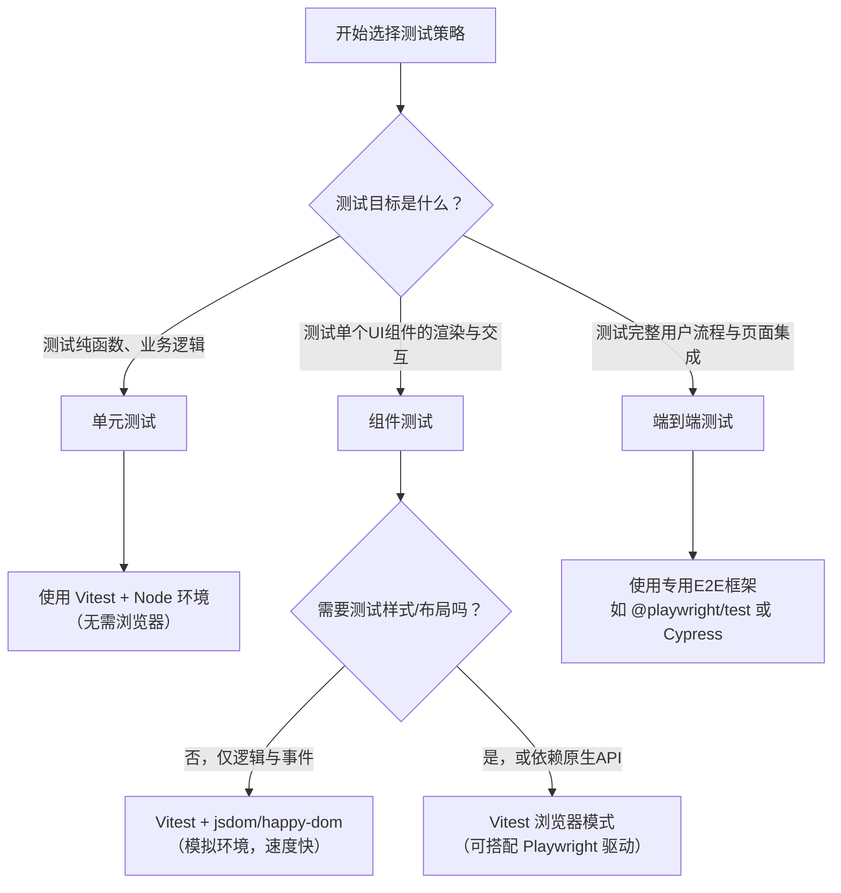

你说得非常准，确实可以这样分为两类。**Playwright 的独特之处在于，它既可以直接驱动真实浏览器，也提供了一个名为 `@playwright/test` 的高层 API，这套 API 本身就是一套在 Node.js 环境中编写的、模拟用户操作规范的测试框架**。

下面是这两种核心模式的详细对比和解析：

### 核心分类与 Playwright 的角色

| 类别 | 核心理念 | 代表工具 | Playwright 的对应模式与角色 |
| :--- | :--- | :--- | :--- |
| **模拟浏览器规范实现** | **在 Node.js 进程中，用 JavaScript 模拟一套 Web 标准 API (如 DOM)。** 测试代码和被测试代码都在同一个 Node 进程中运行。 | **jsdom**, **happy-dom** | **作为 `jsdom` 的替代或补充**：<br>你可以通过 Playwright 的 **Node.js API** 在测试中启动浏览器、执行脚本，将结果传回Node断言。但这本质仍是 **“Node程序调用浏览器”**，而非完整的 E2E 测试框架体验。 |
| **在真实浏览器中运行测试** | **测试代码（Test Runner）本身就在真实的浏览器上下文中执行。** 能获得最真实的渲染、事件、网络环境。 | **Cypress**, **Selenium** (WebDriver) | **作为 `@playwright/test` 框架的核心**：<br>这是 Playwright 的**主要使用方式**。它的测试运行器将你的测试代码注入浏览器上下文，并提供一整套丰富的 API 进行页面操作和断言，是**完整的E2E测试框架**。 |
| **Vitest 的“浏览器模式”** | 一个**混合模式**：Vitest 作为主控，将测试文件和组件代码分发到真实的浏览器中运行并收集结果，但其**编写风格（describe, it, expect）依然是单元/组件测试**。 | **Vitest** | **可作为 Vitest 的后端驱动**：Vitest 官方支持使用 Playwright 启动的浏览器作为其“浏览器模式”的执行环境。此时，你写的是 Vitest 组件测试，但运行在 Playwright 管理的真实浏览器里。 |

---

### Playwright 的两种使用模式详解

#### 模式一：作为 Node.js 库驱动真实浏览器（你提到的“兼容”）
在这种模式下，你在一个 Node.js 测试脚本（可以是 Vitest 或 Jest 测试）中，通过 `playwright` 核心库启动并控制浏览器。这就像用一个功能强大的遥控器去操作一个真实的浏览器玩具。

```javascript
// 示例：在 Vitest 测试中使用 Playwright Node API
import { chromium } from 'playwright';
import { test, expect } from 'vitest';

test('使用Playwright Node API获取页面标题', async () => {
  // 启动一个真实的Chromium浏览器
  const browser = await chromium.launch({ headless: true });
  const page = await browser.newPage();
  
  // 导航到页面
  await page.goto('https://example.com');
  
  // 在浏览器中执行代码并获取结果
  const title = await page.title();
  
  // 在Node端使用Vitest进行断言
  expect(title).toBe('Example Domain');
  
  await browser.close();
});
```
**特点**：你**主动管理**浏览器的生命周期，测试逻辑和断言**主要写在 Node 端**。适合在单元测试中需要**偶尔**验证真实浏览器行为的复杂场景，但不是写E2E测试的主流方式。

#### 模式二：作为独立的 E2E 测试框架 (`@playwright/test`)
这是 Playwright 的**主力模式**。你需要使用其专用的测试运行器和 API。

1.  **安装与配置**：
    ```bash
    npm init playwright@latest
    ```

2.  **编写测试**：测试文件以 `.spec.ts` 结尾，使用 Playwright 提供的 `test` 和 `expect`。
    ```javascript
    // example.spec.ts
    import { test, expect } from '@playwright/test';

    test('基本的端到端测试', async ({ page }) => { // `page` fixture 由框架注入
      await page.goto('https://example.com');
      // expect 是Playwright内置的，针对异步操作优化
      await expect(page).toHaveTitle('Example Domain');
      
      // 模拟完整用户交互
      const link = page.getByText('More information...');
      await expect(link).toBeVisible();
      await link.click();
      // ... 断言新页面
    });
    ```
    **特点**：测试代码**本身就在浏览器上下文中运行**。`page` 对象是框架通过 `fixture` 自动提供的。所有 API 为异步操作和 Web 断言做了深度优化，是编写完整用户流程测试的利器。

#### 模式三：作为 Vitest 浏览器模式的驱动
这是 Playwright 与组件测试的深度融合。

1.  **配置 Vitest**：
    ```bash
    npm install -D @vitest/browser playwright
    ```
    ```javascript
    // vitest.config.ts
    import { defineConfig } from 'vitest/config';
    export default defineConfig({
      test: {
        browser: {
          enabled: true,
          provider: 'playwright', // 使用playwright驱动浏览器
          instances: [{ browser: 'chromium' }]
        },
        // 你的测试文件匹配规则
      },
    });
    ```

2.  **编写组件测试**：你可以像写普通 Vitest 组件测试一样写，但它会在浏览器中运行。
    ```javascript
    // component.test.ts
    import { test, expect } from 'vitest';
    import { mount } from '@vue/test-utils';
    import MyComponent from './MyComponent.vue';

    test('在真实浏览器中渲染组件', async () => {
      // mount 函数在浏览器内执行，返回真实的DOM
      const wrapper = await mount(MyComponent);
      // 你可以使用任何浏览器内的API进行断言
      await expect(wrapper.find('button').element).toBeVisible();
    });
    ```
    **特点**：你**写的是组件测试**，但**运行在真实浏览器**里。这是测试组件**样式、布局、浏览器原生API**兼容性的终极方案，同时保持了Vitest的开发体验。

---

### 总结：如何选择？

根据你的测试金字塔层级来选择工具和模式：



简单来说：
*   要测**业务逻辑**，用 **Vitest (Node环境)**。
*   要测**组件交互**，用 **Vitest + jsdom/happy-dom**。
*   要测**组件在真实浏览器的表现**，用 **Vitest 浏览器模式（可配Playwright驱动）**。
*   要测**完整的用户流程和集成**，直接用 **`@playwright/test`**。

**结论**：Playwright 是一个**跨越了两类**的解决方案。它的 `@playwright/test` 框架属于 **“在真实浏览器中运行测试”**，而其底层的 Node.js 库又可以让你在 **“模拟浏览器环境的规范实现”** 的测试中，**按需调用真实浏览器**。这种灵活性是它的核心优势。

如果你正在为一个具体项目设计测试方案，可以分享一下项目类型（如是一个管理后台、一个动画库还是一个移动端H5），我可以给出更具体的组合建议。


---
---
---

# 两种组件测试事例对比

# Vitest 4 + jsdom vs Vitest 4 浏览器模式 + Playwright 详细对比

我将从配置、API使用、测试编写等方面详细对比这两种测试方式，并提供实际开发中的常用示例。

## 📊 核心对比概览

| 维度 | Vitest 4 + jsdom/happy-dom | Vitest 4 浏览器模式 + Playwright |
|------|---------------------------|----------------------------------|
| **环境本质** | Node.js进程中模拟DOM | 真实浏览器进程 |
| **渲染保真度** | 模拟渲染，不计算实际样式 | 真实渲染引擎计算样式 |
| **CSS/样式测试** | 只能测内联样式或类名 | 可测计算样式、布局、动画 |
| **DOM API** | 部分模拟，API有限 | 完整的Web API支持 |
| **性能** | 极快（毫秒级启动） | 较慢（秒级启动浏览器） |
| **适用场景** | 组件逻辑、事件、props验证 | 样式渲染、布局、动画、真实交互 |
| **测试文件示例** | `FadeBox.logic.test.ts` | `FadeBox.render.test.ts` |

## 🛠️ 配置区别

### Vitest 4 + jsdom 配置
```typescript
// vitest.config.ts
export default defineConfig({
  test: {
    environment: 'jsdom', // 或 'happy-dom'
    // 无需额外安装浏览器驱动
  }
})
```

```bash
# 安装依赖
npm install -D vitest jsdom @vue/test-utils
# 或使用happy-dom
npm install -D vitest happy-dom @vue/test-utils
```

### Vitest 4 浏览器模式 + Playwright 配置
```typescript
// vitest.config.browser.ts
export default defineConfig({
  test: {
    browser: {
      enabled: true,
      provider: 'playwright',
      name: 'chromium',
      providers: {
        playwright: {
          launch: { browserName: 'chromium', headless: true }
        }
      }
    },
    environment: 'node' // 注意：测试运行器仍在Node中
  }
})
```

```bash
# 安装依赖
npm install -D vitest @vitest/browser @playwright/test playwright
# 安装浏览器
npx playwright install chromium
```

## 📝 测试用例写法区别

### 1. **组件挂载与访问**

#### **jsdom 环境写法**
```typescript
// src/components/FadeBox.logic.test.ts
import { describe, it, expect } from 'vitest'
import { mount } from '@vue/test-utils'
import FadeBox from './FadeBox.vue'

describe('FadeBox - jsdom测试', () => {
  it('通过props控制透明度', () => {
    // 同步挂载，不需要await
    const wrapper = mount(FadeBox, {
      props: { opacity: 0.5 }
    })
    
    // 访问Vue实例
    expect(wrapper.vm.currentOpacity).toBe(0.5)
    
    // 访问包装器的DOM元素
    const boxElement = wrapper.find('.fade-box').element
    // ❌ 注意：jsdom中style可能不是最新的
    // expect(boxElement.style.opacity).toBe('0.5') // 可能不可靠
    
    // 更好的方式：测试Vue组件内部状态
    expect(wrapper.vm.computedStyle.opacity).toBe('0.5')
  })
})
```

#### **浏览器模式写法**
```typescript
// src/components/FadeBox.render.test.ts
import { describe, it, expect } from 'vitest'
import { mount } from '@vue/test-utils'
import FadeBox from './FadeBox.vue'

describe('FadeBox - 浏览器测试', () => {
  it('在真实浏览器中渲染正确透明度', async () => {
    // ✅ 必须使用async/await
    const wrapper = await mount(FadeBox, {
      props: { opacity: 0.5 }
    })
    
    // 等待浏览器下一帧确保渲染完成
    await new Promise(requestAnimationFrame)
    
    // 访问真实DOM元素
    const boxElement = wrapper.find('.fade-box').element
    
    // ✅ 获取浏览器实际计算出的样式
    const computedStyle = window.getComputedStyle(boxElement)
    expect(parseFloat(computedStyle.opacity)).toBeCloseTo(0.5, 2)
    
    // ✅ 可以测试CSS自定义属性
    const cssVar = computedStyle.getPropertyValue('--fade-duration')
    expect(cssVar).toBe('300ms')
  })
})
```

### 2. **事件触发与交互测试**

#### **jsdom 环境写法**
```typescript
describe('事件交互 - jsdom', () => {
  it('点击触发动画开始', async () => {
    const wrapper = mount(FadeBox)
    const button = wrapper.find('button')
    
    // 触发事件
    await button.trigger('click')
    
    // 验证事件发射
    expect(wrapper.emitted('animation-start')).toBeTruthy()
    
    // 验证组件状态变化
    expect(wrapper.vm.isAnimating).toBe(true)
  })
  
  it('模拟键盘事件', async () => {
    const wrapper = mount(FadeBox)
    const input = wrapper.find('input')
    
    await input.trigger('keydown', { key: 'Enter' })
    await input.trigger('keyup', { key: 'Enter' })
    
    expect(wrapper.emitted('submit')).toHaveLength(2)
  })
})
```

#### **浏览器模式写法**
```typescript
describe('事件交互 - 浏览器', () => {
  it('真实点击触发CSS动画', async () => {
    const wrapper = await mount(FadeBox)
    const button = await wrapper.find('button')
    const box = await wrapper.find('.fade-box')
    
    // 记录初始透明度
    const initialOpacity = window.getComputedStyle(box.element).opacity
    
    // 真实点击（会触发浏览器事件冒泡等完整流程）
    await button.element.click()
    
    // 等待动画进行几帧
    await new Promise(resolve => {
      requestAnimationFrame(() => {
        requestAnimationFrame(resolve)
      })
    })
    
    // 验证样式已改变
    const currentOpacity = window.getComputedStyle(box.element).opacity
    expect(parseFloat(currentOpacity)).toBeGreaterThan(parseFloat(initialOpacity))
  })
  
  it('测试复杂手势交互', async () => {
    const wrapper = await mount(SwipeComponent)
    const element = await wrapper.find('.swipe-area')
    
    // ✅ 在浏览器中可以测试更复杂的交互
    const rect = element.element.getBoundingClientRect()
    const startX = rect.left + 50
    const startY = rect.top + 50
    
    // 模拟触摸/鼠标拖动（需要更多代码）
    // 浏览器模式支持完整的Pointer Events API
  })
})
```

### 3. **样式与布局测试**

#### **jsdom 环境写法（受限）**
```typescript
describe('样式测试 - jsdom', () => {
  it('只能测试内联样式和类名', () => {
    const wrapper = mount(FadeBox, {
      props: { 
        style: { 
          '--custom-opacity': '0.3',
          transform: 'translateX(10px)'
        }
      }
    })
    
    const element = wrapper.find('.fade-box').element
    
    // ✅ 可以测试内联样式
    expect(element.style.getPropertyValue('--custom-opacity')).toBe('0.3')
    
    // ✅ 可以测试类名
    expect(element.classList.contains('fade-in')).toBe(true)
    
    // ❌ 不能测试计算样式
    // const computed = window.getComputedStyle(element) // 在jsdom中有限
    // expect(computed.opacity).toBe('0.5') // 不可靠
  })
})
```

#### **浏览器模式写法（完整支持）**
```typescript
describe('样式测试 - 浏览器', () => {
  it('全面测试CSS计算样式', async () => {
    const wrapper = await mount(FadeBox)
    const element = await wrapper.find('.fade-box')
    
    // ✅ 获取完整计算样式
    const computed = window.getComputedStyle(element.element)
    
    // 测试各种CSS属性
    expect(computed.opacity).toBe('0.5')
    expect(computed.transition).toContain('opacity')
    expect(computed.animationName).toBe('fadeIn')
    
    // ✅ 测试布局属性
    const rect = element.element.getBoundingClientRect()
    expect(rect.width).toBeGreaterThan(0)
    expect(rect.height).toBeGreaterThan(0)
  })
  
  it('测试CSS动画关键帧', async () => {
    const wrapper = await mount(AnimatedBox)
    const element = await wrapper.find('.animated')
    
    // 触发动画
    await wrapper.setProps({ play: true })
    
    // 等待动画执行到50%
    await new Promise(resolve => setTimeout(resolve, 150))
    
    const computed = window.getComputedStyle(element.element)
    
    // 测试动画中间状态
    const transform = computed.transform
    expect(transform).toContain('translateX') // 应该包含平移
    expect(transform).not.toBe('none')
  })
})
```

### 4. **时间控制与动画测试**

#### **jsdom 环境写法**
```typescript
import { vi } from 'vitest'

describe('动画测试 - jsdom', () => {
  it('使用假定时器控制动画时间', async () => {
    vi.useFakeTimers()
    
    const wrapper = mount(FadeBox, {
      props: { duration: 1000 }
    })
    
    // 开始动画
    await wrapper.vm.startAnimation()
    
    // 快进500ms
    await vi.advanceTimersByTimeAsync(500)
    expect(wrapper.vm.animationProgress).toBeCloseTo(0.5, 1)
    
    // 快进到结束
    await vi.advanceTimersByTimeAsync(500)
    expect(wrapper.vm.isAnimating).toBe(false)
    
    vi.useRealTimers()
  })
  
  it('模拟requestAnimationFrame', () => {
    const mockRAF = vi.fn()
    vi.stubGlobal('requestAnimationFrame', mockRAF)
    
    const wrapper = mount(AnimationComponent)
    wrapper.vm.startFrameLoop()
    
    expect(mockRAF).toHaveBeenCalled()
    
    vi.unstubAllGlobals()
  })
})
```

#### **浏览器模式写法**
```typescript
describe('动画测试 - 浏览器', () => {
  it('测试真实动画时间线', async () => {
    const wrapper = await mount(FadeBox, {
      props: { duration: 1000 }
    })
    
    const element = await wrapper.find('.fade-box')
    const startTime = performance.now()
    
    // 开始动画
    await wrapper.setProps({ animate: true })
    
    // 等待动画结束
    await new Promise<void>((resolve) => {
      const checkAnimation = () => {
        const computed = window.getComputedStyle(element.element)
        if (computed.opacity === '1') {
          resolve()
        } else {
          requestAnimationFrame(checkAnimation)
        }
      }
      requestAnimationFrame(checkAnimation)
    })
    
    const endTime = performance.now()
    const duration = endTime - startTime
    
    // 验证动画大约持续了1秒（允许误差）
    expect(duration).toBeGreaterThanOrEqual(900)
    expect(duration).toBeLessThanOrEqual(1100)
  })
})
```

## 🔧 常用API对比表

### 获取和操作元素

| 操作 | jsdom API | 浏览器模式 API | 说明 |
|------|-----------|---------------|------|
| **获取元素** | `wrapper.find('.class')` | `wrapper.find('.class')`<br>`document.querySelector()` | 浏览器模式两者都可用 |
| **获取计算样式** | 有限支持<br>`element.style` | `window.getComputedStyle(el)` | jsdom中计算样式不可靠 |
| **获取尺寸位置** | `element.offsetWidth`<br>（模拟值） | `el.getBoundingClientRect()` | 浏览器中获取真实布局 |
| **触发事件** | `wrapper.trigger('click')` | `element.click()`<br>`wrapper.trigger('click')` | 浏览器中事件更真实 |
| **等待元素** | 不需要，同步 | `await waitFor(() => element)` | 浏览器中需要等待渲染 |

### 动画相关API

| 操作 | jsdom实现 | 浏览器原生实现 | 测试建议 |
|------|-----------|---------------|----------|
| **requestAnimationFrame** | 需模拟 | 原生支持 | 动画测试选浏览器模式 |
| **CSS动画事件** | 需手动触发 | `animationend`<br>`transitionend` | 浏览器中可测真实事件 |
| **Web Animations API** | 有限支持 | 完整支持 | `element.animate()` |
| **IntersectionObserver** | 需模拟 | 原生支持 | 滚动动画必须用浏览器 |

### 特定场景示例

#### 场景1：测试一个淡入动画组件

**jsdom测试文件**：
```typescript
// FadeIn.logic.test.ts - 测试逻辑
import { mount } from '@vue/test-utils'
import FadeIn from './FadeIn.vue'

describe('FadeIn组件逻辑', () => {
  it('当in prop为true时开始动画', async () => {
    const wrapper = mount(FadeIn, {
      props: { in: false }
    })
    
    // 初始状态
    expect(wrapper.vm.isVisible).toBe(false)
    
    // 改变prop触发动画
    await wrapper.setProps({ in: true })
    
    // 验证状态改变
    expect(wrapper.vm.isVisible).toBe(true)
    expect(wrapper.emitted('enter-start')).toBeTruthy()
    
    // 验证类名变化
    expect(wrapper.find('.fade-in').classes()).toContain('active')
  })
})
```

**浏览器测试文件**：
```typescript
// FadeIn.render.test.ts - 测试渲染
import { mount } from '@vue/test-utils'
import FadeIn from './FadeIn.vue'

describe('FadeIn组件渲染', () => {
  it('在浏览器中正确执行CSS过渡', async () => {
    const wrapper = await mount(FadeIn, {
      props: { in: false, duration: '0.3s' }
    })
    
    const element = await wrapper.find('.fade-in')
    const computed = window.getComputedStyle(element.element)
    
    // 初始透明度应为0
    expect(computed.opacity).toBe('0')
    expect(computed.transition).toContain('0.3s')
    
    // 触发进入动画
    await wrapper.setProps({ in: true })
    
    // 等待过渡开始
    await new Promise(requestAnimationFrame)
    
    // 验证透明度在变化
    const midTransition = window.getComputedStyle(element.element)
    expect(midTransition.opacity).not.toBe('0')
    
    // 等待过渡完成
    await new Promise(resolve => {
      element.element.addEventListener('transitionend', resolve, { once: true })
      // 超时回退
      setTimeout(resolve, 500)
    })
    
    // 最终应为完全不透明
    const final = window.getComputedStyle(element.element)
    expect(final.opacity).toBe('1')
  })
})
```

## 📋 最佳实践建议

### 何时使用哪种方式？

1. **使用 jsdom/happy-dom 的情况**（80%的测试）：
   - 测试组件逻辑、props、事件
   - 测试条件渲染、列表渲染
   - 测试表单交互
   - 测试Composables逻辑
   - **需要快速反馈的开发阶段**

2. **使用浏览器模式的情况**（20%的测试）：
   - 测试CSS动画、过渡效果
   - 测试布局、响应式设计
   - 测试IntersectionObserver相关逻辑
   - 测试Canvas/SVG渲染
   - 测试第三方库的浏览器兼容性
   - **CI/CD中的集成测试**

### 混合使用的项目配置

```typescript
// package.json
{
  "scripts": {
    // 开发时快速运行逻辑测试
    "test:dev": "vitest run src/**/*.logic.test.ts",
    
    // 提交前运行所有逻辑测试
    "test": "vitest run src/**/*.test.ts --exclude **/*.render.test.ts",
    
    // 专门运行浏览器测试
    "test:render": "vitest run src/**/*.render.test.ts --config vitest.config.browser.ts",
    
    // CI中运行所有测试
    "test:ci": "npm run test && npm run test:render"
  }
}
```

### 文件命名约定

```
src/components/
├── FadeBox.vue                    # 组件
├── FadeBox.logic.test.ts          # jsdom测试（逻辑）
└── FadeBox.render.test.ts         # 浏览器测试（渲染）
```

### 性能优化技巧

1. **jsdom测试要快**：
   ```typescript
   // 使用vi.useFakeTimers()避免真实等待
   vi.useFakeTimers()
   // 测试代码
   await vi.advanceTimersByTimeAsync(1000)
   vi.useRealTimers()
   ```

2. **浏览器测试要稳定**：
   ```typescript
   // 添加适当的等待
   await new Promise(requestAnimationFrame)
   // 或使用浏览器提供的等待
   await element.waitFor({ state: 'visible' })
   ```

3. **并行运行**：
   ```bash
   # 在CI中并行运行不同环境测试
   vitest run --project=node & 
   vitest run --project=dom &
   vitest run --config=vitest.config.browser.ts
   ```

## 🚀 总结

对于你的动画库项目：
- **单元测试和Composables测试**：使用Vitest + jsdom，测试纯逻辑
- **组件逻辑测试**：使用Vitest + jsdom，测试props、事件、状态
- **动画渲染测试**：使用Vitest浏览器模式 + Playwright，测试真实动画效果

这样的分层测试策略既能保证开发速度，又能确保动画在真实浏览器中的表现符合预期。